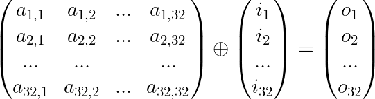

# Nintendo European Research & Development - HireMe.c

>“Crypto is like catnip for programmers. It’s hard to keep us away from it, because it’s challenging and fun to play with. And programmers respond very badly to the insinuation that they’re not clever enough to do something.”—Maciej Cegłowski

My algorithm cracks [NERD HireMe](https://www.nerd.nintendo.com/files/HireMe) for any output within 1 Second **without Brute-Force**! Read more if you want to find out how this was accomplished or execute this algorithm yourself on [Wandbox](https://wandbox.org/) - Online C++ Compiler
## Solution
  1. Seperate the algorithm into parts: S-Box, XOR-Matrix, Odd-Even-Merge
  2. Create Reverse Lookup for the S-box
  3. Inverse the Square-Matrix with [Gaussian elimination](https://en.wikipedia.org/wiki/Gaussian_elimination)
  4. Find candidates for the Odd-Even-Merge
  5. Evaluate the S-Box and analyse the set of working candidates
  6. Span a subset of values that are not affected by the XOR-Matrix
  7. Alter the Reverse Lookup to guarantee staying within the subset in an arbitrary amount of reverse lookups
  8. Narrow it down to values that are also not affected by a combination of inverse matrix and reverse lookup

### 1. Seperate the algorithm into parts
#### S-box
This part looks like it can be easily reversed by making a second confusion that uses the first confusion's results as indices and the first confusions indeces as results, just like you would reverse any other S-box but it turns out that there is a bit more work needed.
```c
// part A: S-box
for( u8 j = 0; j < 32; j++ ) {
    // confusion range is [0, 256)
    output[ j ] = confusion[ input[ j ] ];
    input[ j ] = 0;
}
```
#### XOR-Matrix
This part can also be expressed as a system of equations where each input is the result of a bunch of outputs XOR'd together and not only the dimensions are fixed but also the amount of outputs XOR'd to make each input.
```c
// part B: 32x32 Matrix
for( u8 j = 0; j < 32; j++ )
    for( u8 k = 0; k < 32; k++ )
        // The diffusion part looks a bit confusing but since it can only be
        // either 1 or 0 it just means some outputs are XORd and some aren't
        input[ j ] = input[ j ] ^ output[ k ] * ( ( diffusion[ j ] >> k ) & 1 );
```
#### Odd-Even-Merge
At first this looks too easy because for a given character in output this equation has so many solutions and all we need is just one to reverse this part but it was way more headache-inducing as you find out later.
```c
// part C: Odd-Even-Merge
for( u8 i = 0; i < 16; i++ )
    // Two parts of confusion are combined here: [0, 256) for even numbers
    // and [256, 512) for odd numbers which XORd creates one character of output
    output[ i ] = confusion[ input[ i * 2 ] ] ^ confusion[ input[ i * 2 + 1 ] + 256 ];
```
### 2. Reverse Lookup for the S-box
When we look at the main confusion used in **part A** we are quick to notice from the **512** values only **256** will be used here, since the maximum for any input is **0xff** so we can simply do a reverse lookup on **[0, 256)** but there is still one thing to be acknowledged, some values within the confusion are duplicated,
```c
u8 confusion[512] = {
	0xac,0xd1,0x25,0x94,0x1f,0xb3,**0x33**,0x28,...
	...,0x54,0xa7,0x78,0xa4,0x89,**0x33**,0x6d,...
};
```
which means when we create a reverse lookup we can't connect each output from the confusion **1-to-1** to an input, there are multiple possibilities sometimes and it seems like we have to split into multiple different strings and try all of them whenever we have multiple possibilities because we can't guess which one was picked.
```c
std::vector< int > confusion_reverse[] = {
	...,{251},{200},**{6,154}**,{140},{115},...
};
```
### 3. Inverse the Square-Matrix
You might wonder what this has to do with matrices at first but when you take a closer look at **part B** you will notice each **32-bit** value of the diffusion array is picked and then shifted by **[0, 32)-bit** with the &-operator accomplishing that each bit of a value decides whether a certain output is XOR'd.
```c
for( u8 j = 0; j < 32; j++ )
	for( u8 k = 0; k < 32; k++ )
		input[ j ] = input[ j ] ^ output[ k ] * ( ( diffusion[ j ] >> k ) & 1 );
```
Since the diffusion is fixed the outputs getting XOR'd for a specific input within the loop always stay the same, so all we need to do is construct a simple collection of **1s** and **0s** to decide which outputs get XOR'd.
```c
for( u8 j = 0; j < 32; j++ )
	for( u8 k = 0; k < 32; k++ )
		input[ j ] = input[ j ] ^ output[ k ] * mat[ j ][ k ];
```
If we take yet another closer look at the diffusion there is another interesting thing to notice, the numbers picked for the diffusion don't seem to be too random, if we look at the binary representation we can see that the amount of outputs XOR'd per input is fixed as well.
```c
u32 diffusion[32] = {
	11110010011011001011010010000001,
	00010110101001011101110010010010,
	00111100010110111010100100100100,
	01111001101101100101001001001000,...
};
```
You will notice that for each number it is always **15** **1s** and **17** **0s** so the amount of outputs XOR'd for each input also stays **15** which means our matrix is already fairly clear, it has to be **32x32** and it has to have **15** **1s** per row which we can easily extract from the diffusion values if we reverse the binary because of the bit-shifting.
```c
matrix gaussian_grid = {
	{1,0,0,0,0,0,0,1,0,0,1,0,1,1,0,1,0,0,1,1,0,1,1,0,0,1,0,0,1,1,1,1},
	{0,1,0,0,1,0,0,1,0,0,1,1,1,0,1,1,1,0,1,0,0,1,0,1,0,1,1,0,1,0,0,0},
	{0,0,1,0,0,1,0,0,1,0,0,1,0,1,0,1,1,1,0,1,1,0,1,0,0,0,1,1,1,1,0,0},
	...
};
```

Now all that's left to do is inverse it to satisfy **M * M^(-1) = I**, which can be accomplished by multiple methods of choice, you could also make use of the equation system and plug it into Z3 but for anyone still reading this here is a small gold nugget for you to catch to thank your careful attention so far ;)
```c
bool isXorInvolutory( int mat[ 32 ][ 32 ] ) {
	int res[ 32 ][ 32 ] = { 0 };
	for( int i = 0; i < 32; i++ )
		for( int j = 0; j < 32; j++ )
			for( int k = 0; k < 32; k++ )
				res[ i ][ j ] ^= mat[ i ][ k ] * mat[ k ][ j ];
	for( int i = 0; i < 32; i++ ) {
		for( int j = 0; j < 32; j++ ) {
			if( ( i == j ) && ( res[ i ][ j ] != 1 ) )
				return false;
			if( ( i != j ) && ( res[ i ][ j ] != 0 ) )
				return false;
		}
	}
	return true;
}
```
### 4. Candidates for the Odd-Even-Merge
```c
for( u8 i = 0; i < 16; i++ )
    // This has been adjusted to address the different ranges from confusion
    output[ i ] = confusionA[ input[ i * 2 ] ] ^ confusionB[ input[ i * 2 + 1 ] ];
```
Before we get into detail with this one let's simplify what's happening here, we won't tackle the actual problem right of the bat but get a deeper understanding what this does, so if you remember our input it has **32** characters and that doesn't change within the rounds but forward()'s output is only **16** characters and this is why.
```c
for( u8 i = 0; i < 16; i++ )
    output[ i ] = input[ i * 2 ] ^ input[ i * 2 + 1 ];
```
First lets remove the confusion because we already know what it does and how we have to approach reverting it and focus on what we are left with, that is the **2 XORs** making **1 byte** of output, this reduces our **32 byte** input to only **16 byte** by picking **[0,1]**,**[2,3]**,**[4,5]**,... input pairs of **one even** index and **one odd** index.
```c
0x66 ^ 0x2e = 0x48,
0xd5 ^ 0x9d = 0x48,
0x4e ^ 0x06 = 0x48,
...
```
So essentially for an output like "**Hire me!!!!!!!!\0**" which is **16 byte** for the first character **'H'** we have to find **2 byte** that when XOR'd have that character as a result, surprisingly that is not too hard you can find many solutions to this. So we can build many **32 byte** arrays that XOR to **16 byte** "**Hire me!!!!!!!!\0**", and loop them through the inverse of the matrix and the reverse lookup and then call it a day right?
```c
std::vector< int > confusion_reverse256A[] = {
    ...,{47},{223},{70},{},{88},{},{245},{42},...
};
```
Unfortunately what will happen is a ton of arrays constructed that way end up on "holes" in the reverse lookup at some point inside the loop. These holes exist because of the repeated values, so the holes are actually values that aren't present in the original confusion because of the space taken by the repeated values.

### 5. Evaluate the S-Box
In order to move forward and make progress we are left with **2 choices** now, **either** we build all combinations of **2 XORs** for each byte and build tons of arrays from these to try as we have to do some permutation as well, **or** we try finding out what we can do to find a valid string that avoids holes without having to **Brute-Force** all possibilities.
```c
u8 holes[] = {
    0x0f, 0x11, 0x20, 0x3e, 0x44, 0x5a, 0x6b, 0x75,
    0x80, 0x9e, 0xaf, 0xb1, 0xcb, 0xd5, 0xe4, 0xfa
};
```
If we take a closer look where the holes appear inside confusion we can make a set of numbers that we basically have to avoid somehow during the entire process, so what we need to do is find a pattern here to work with to easily avoid these numbers, and thankfully so that is not too hard as we can already make adjustments to this set.
```c
u8 holes_simplified[] = {
    0x0f, 0x01, 0x00, 0x0e, 0x04, 0x0a, 0x0b, 0x05
};
```
When we look at the High Byte 0x10 of the values in holes we can see there is a simple counting pattern and there doesn't seem to be anything more to it, so let's remove it and look at the remaining values which are now reduced from **16 byte** to **8 byte** because half the holes shared the Low Byte 0x01 part of the values before.
```c
u8 missing_from_holes_simplified[] = {
    0x0c, 0x0d, 0x02, 0x03, 0x06, 0x07, 0x08, 0x09
};
```
By looking at the binary representation you can see the values that land in holes all share a fixed set of bits that are either **1** or **0** **together** while from the missing set those bits are either (**0** and **1**) or (**1** and **0**) which leads us to the next step.

### 6. Span a subset of values
Now that we know what pattern to avoid to not land on holes we can span a vector of **128 byte** which contains the values following the pattern of either (**0** and **1**) or (**1** and **0**), but for readability we keep them seperated in **2 vectors** of **64 byte** as follows
```c
u8 values01[ 64 ] = {
    0x02, 0x03, 0x06, 0x07, 0x12, 0x13, 0x16, 0x17,
    0x22, 0x23, 0x26, 0x27, 0x32, 0x33, 0x36, 0x37,
    0x42, 0x43, 0x46, 0x47, 0x52, 0x53, 0x56, 0x57,
    0x62, 0x63, 0x66, 0x67, 0x72, 0x73, 0x76, 0x77,
    0x82, 0x83, 0x86, 0x87, 0x92, 0x93, 0x96, 0x97,
    0xa2, 0xa3, 0xa6, 0xa7, 0xb2, 0xb3, 0xb6, 0xb7,
    0xc2, 0xc3, 0xc6, 0xc7, 0xd2, 0xd3, 0xd6, 0xd7,
    0xe2, 0xe3, 0xe6, 0xe7, 0xf2, 0xf3, 0xf6, 0xf7
};
u8 values10[ 64 ] = {
    0x08, 0x09, 0x0c, 0x0d, 0x18, 0x19, 0x1c, 0x1d,
    0x28, 0x29, 0x2c, 0x2d, 0x38, 0x39, 0x3c, 0x3d,
    0x48, 0x49, 0x4c, 0x4d, 0x58, 0x59, 0x5c, 0x5d,
    0x68, 0x69, 0x6c, 0x6d, 0x78, 0x79, 0x7c, 0x7d,
    0x88, 0x89, 0x8c, 0x8d, 0x98, 0x99, 0x9c, 0x9d,
    0xa8, 0xa9, 0xac, 0xad, 0xb8, 0xb9, 0xbc, 0xbd,
    0xc8, 0xc9, 0xcc, 0xcd, 0xd8, 0xd9, 0xdc, 0xdd,
    0xe8, 0xe9, 0xec, 0xed, 0xf8, 0xf9, 0xfc, 0xfd
};
```
If we combine the values above in **15 XORs** or any odd amount like **3-XOR** it is easy to show they will remain within their respective set and thus are not affected by the matrix operation which guarantees they are lookup-able in the first round after diffusion, but there is still more to it as we're not done yet...
```c
0x02: 00000010
0x03: 00000011 (XOR)
0x06: 00000110 (XOR)
----------
0x07: 00000111
```
As we see the sets can successfully avoid the diffusion step so if we carefully pick values for **cA** and **cB** from the respective sets the equation system below will not give any results outside the set
```c
input[00] = cA[00] ^ cB[07] ^ cA[10] ^ cA[12] ^ cB[13] ^ cB[15] ^ cA[18] ^ cB[19] ^ cB[21] ^ cA[22] ^ cB[25] ^ cA[28] ^ cB[29] ^ cA[30] ^ cB[31];
input[01] = cB[01] ^ cA[04] ^ cB[07] ^ cA[10] ^ cB[11] ^ cA[12] ^ cA[14] ^ cB[15] ^ cA[16] ^ cA[18] ^ cB[21] ^ cB[23] ^ cB[25] ^ cA[26] ^ cA[28];
input[02] = cA[02] ^ cB[05] ^ cA[08] ^ cB[11] ^ cB[13] ^ cB[15] ^ cA[16] ^ cB[17] ^ cB[19] ^ cA[20] ^ cA[22] ^ cA[26] ^ cB[27] ^ cA[28] ^ cB[29];
...
```

### 7. Alter the S-box
Unfortunately confusion can still generate holes itself in subsequent reverse lookups so we have to narrow our subset down to ensure not only a safe **first round** reverse lookup but in **256** rounds, so what we are left with is **64** bytes split across **2** vectors to guarantee the starting point values are always lookup-able.
If we start using these now, we will notice that we can still end up on holes quite often and it didn't really help yet, this is because the confusion can still pick numbers outside of our set and diffusion can make these then "worse" by affecting other numbers. In other words **we have to narrow it down even further** and make sure confusion can't pick any numbers outside of our set, so confusion can not only never land on holes but also never land on any "bad" numbers that can lead to holes when XOR'd by diffusion.
```c
std::vector< int > confusion_reverse256A_opt[] = {
	{},{},{24},{89},{56},{86},{227},{195},
	{},{},{188},{},{},{},{70},{},
	{88},{},{},{},{247},{},{},{},
	{204},{221},{23},{246},{83},{131},{},{},...
};
```
This is where everything gets weird, because whenever we have a choice between two, we have to make sure to pick values within our set and whenever the value is outside of our set and we don't have a choice we might as well consider it a hole because we can't use it, which makes our confusion even more filled with holes then it was to begin with, which is very counterintuitive and confusing.
### 8. Narrow it down
```c
for( int i = 0; i < 64; i++ ) {
	lookup = values[ i ];
	for( int j = 0; j < 256; j++ ) {
		std::vector< int > tmp = confusion_reverse[ ( int )lookup ];
		if( tmp.empty() ||
		  ( utl::toBin( ( u8 )tmp[ 0 ] )[ 1 ] == utl::toBin( ( u8 )tmp[ 0 ] )[ 3 ] ) )
			break;
		lookup = ( u8 )tmp[ 0 ];
		if( j == 255 )
			success = true;
	}
	if( success ) {
		safe.push_back( ( int )values[ i ] );
		success = false;
		++k;
	}
}
```
If we run the algorithm to find save values on the altered reverse lookup now, we receive an even smaller vector of **16 byte**, that really doesn't make you optimistic to reverse any output with such small character set, but as it turns out it is precisely enough to reverse any output. There can still be optimizations made regarding the reverse lookup as you can use the **512 byte** confusion to generate your reverse lookup and then optimize it, this gave me a larger set of **24 byte** but I found this to be useless as the pairs of **16 byte** are already enough to generate any of the **0** to **255** values.

## Review
This challenge took a couple weeks for me to finish and I got stuck a couple times along the way, the most memorable one being starring at the values representing the holes and trying to wrap my mind around how I can avoid them successfully, with that being said it was fun and refreshing to do since all the work on encryption I have done so far is just theoretical stuff around Rijndael.

## Copyright and license
Code and documentation copyright 2021 Alexander Töpfer. Code released under the MIT License
